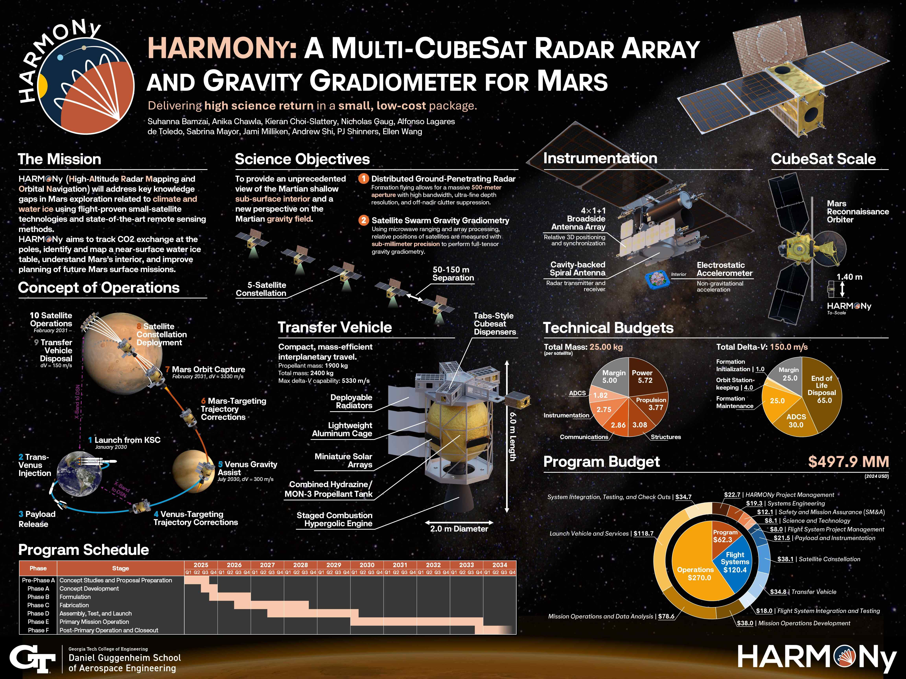

rt---
layout: default
title: Anika Chawla
---

# Anika Chawla

*Uncertainty-aware modeling and decision-making for climate-relevant systems*

I am a researcher focused on developing uncertainty-aware, decision-centric modeling frameworks for complex environmental and infrastructure systems. My work examines how uncertainty, model discrepancy, and data limitations shape operational and policy decisions, with the goal of making technical models more credible, interpretable, and actionable in real-world contexts.

My interests lie at the intersection of uncertainty quantification, sequential decision-making, and climate-relevant systems, with an emphasis on translating modeling results into decisions under institutional, operational, and computational constraints.

---

## Research (Core Focus)

### Operational Contrail Mitigation under Uncertainty  
**Context**  
Operational aviation decisions with potentially large climate consequences must be made under deep atmospheric and model uncertainty.

**Methods**  
Probabilistic modeling, surrogate models, sensitivity analysis, sequential decision frameworks.

**Contributions**
- Developed uncertainty-aware models to evaluate contrail-avoidance strategies under imperfect atmospheric information  
- Analyzed when predicted climate benefits were decision-relevant versus dominated by uncertainty  
- Framed contrail mitigation as a sequential decision problem constrained by operational feasibility  

*Key takeaway:* Climate mitigation decisions depend as much on uncertainty structure and feasibility as on predicted impact.

---

### FAA CLEEN ASCENT — Technology Adoption and Climate Impact  
**Context**  
Fleet-level emissions outcomes depend on both technological performance and real-world adoption dynamics.

**Methods**  
Scenario analysis, sensitivity studies, systems-level modeling.

**Contributions**
- Evaluated how assumptions about technology adoption and policy scenarios influence fleet-level climate outcomes  
- Assessed sensitivity of emissions conclusions to modeling, economic, and adoption assumptions  
- Highlighted gaps between technological potential and realized societal impact  

*Key takeaway:* Adoption uncertainty plays a central role in translating engineering advances into climate benefit.

---

## Selected Collaborative Projects

### Senior Design Project — Systems-Level Design under Constraints  
**Context**  
Capstone design project requiring integration of performance, cost, feasibility, and stakeholder constraints.

**Methods**  
Systems modeling, trade studies, sensitivity analysis.

**Contributions**
- Led system-level trade studies across competing architectures under multiple constraints  
- Integrated subsystem analyses into a coherent decision framework to support final design selection  
- Evaluated how key assumptions and uncertainties influenced design outcomes  

*Key takeaway:* Feasibility, uncertainty, and stakeholder constraints often determine outcomes more than technical optimality.

---

### Machine Learning for Inland Water Quality Monitoring (Collaborative Course Project)  
**Context**  
Environmental monitoring using satellite data is limited by sparse ground truth and model uncertainty.

**Methods**  
Linear regression, random forests, gradient-boosted trees, neural networks, feature selection.

**Contributions**
- Conducted comparative analysis of linear, tree-based, and neural models using the AquaSat dataset  
- Identified strong nonlinear structure and limitations of linear approaches  
- Examined implications of model choice, uncertainty, and interpretability for decision-relevant use of ML  

*Key takeaway:* Predictive performance gains must be balanced with uncertainty awareness and interpretability in environmental decision support.

---

## Interests & Skills

**Research Interests**
- Uncertainty quantification and model discrepancy  
- Decision-making under imperfect information  
- Surrogate modeling for complex systems  
- Explainable, decision-centric machine learning  
- Climate-relevant environmental and infrastructure systems  

**Technical Skills**
- Modeling & Inference: Bayesian methods, probabilistic surrogates, sensitivity analysis  
- Decision Frameworks: Sequential decision-making, scenario evaluation  
- Tools: Python, NumPy, Pandas, Scikit-learn, XGBoost, PyTorch  

---

## Contact
Linkedin
