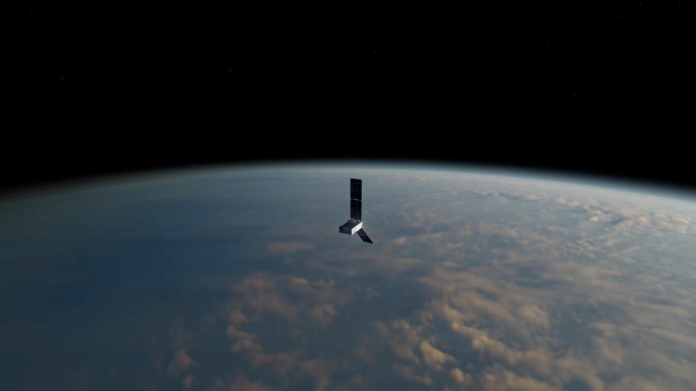
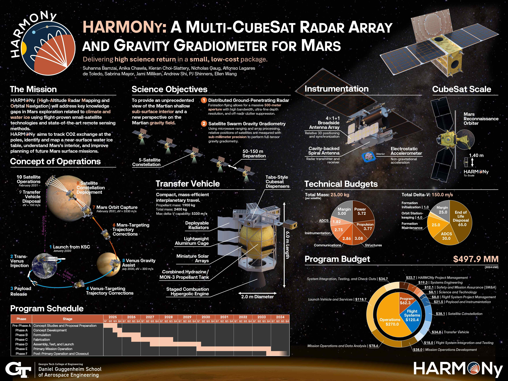

*Modeling, simulation, and AI for aerospace, environmental, and climate-relevant systems*

I am an M.S. student in Aerospace Engineering at Georgia Tech working at the intersection of **modeling, simulation, and machine learning for complex aerospace and environmental systems**.

My work focuses on building **computational models, algorithms, and analysis tools** that help engineers understand system behavior and make decisions under uncertainty. I am  interested in applications involving **space systems, remote sensing, environmental monitoring, and sustainable aviation**.

Much of my work involves developing **data-driven and physics-informed models**, implementing **machine learning methods**, and applying **explainability techniques** to ensure that model outputs are interpretable and trustworthy. This is increasingly important in aerospace and environmental applications where models inform operational, regulatory, or safety-critical decisions.

I am currently pursuing my Master's at Georgia Tech in Aerospace Engineering and conducting research in the Aerospace Systems Design Laboratory on the **FAA CLEEN (Continuous Lower Energy, Emissions and Noise) ASCENT project**.

---

## Selected Work

### Operational Contrail Mitigation under Uncertainty — Independent
**Context**  
Small operational aviation decisions can have large climate consequences, but must be made with incomplete atmospheric information and imperfect models.

**Methods**  
Probabilistic modeling, surrogate models, sensitivity analysis, sequential decision frameworks

**Work**
- Developed computational models to evaluate contrail mitigation strategies under uncertain atmospheric conditions  
- Built surrogate models to approximate computationally expensive atmospheric simulations  
- Analyzed when predicted climate benefits are robust versus dominated by uncertainty  
- Framed contrail mitigation as an operational decision problem constrained by feasibility and uncertainty  

*Key takeaway:* Climate mitigation decisions depend on uncertainty structure and operational feasibility in addition to predicted impact.

---

### FAA CLEEN ASCENT — Aerospace Systems Design Lab @ Georgia Tech
**Context**  
Evaluating the environmental impact of future aviation technologies requires linking propulsion models, aircraft performance models, and fleet adoption scenarios.

**Methods**  
Engine cycle modeling, aircraft performance modeling, fleet simulation, Python analysis

**Work**
- Conduct engine cycle and aircraft performance analysis using **EDS and FLOPS** to evaluate fuel burn, emissions, and noise impacts of propulsion architectures  
- Developed Python analysis tools to process simulation outputs and evaluate large propulsion technology trade spaces  
- Implemented fleet scenario models incorporating aircraft turnover and technology adoption timelines  
- Evaluated long-term environmental outcomes across multiple propulsion and policy scenarios

*Key takeaway:* Environmental outcomes depend strongly on how propulsion technologies propagate through aircraft performance and fleet adoption dynamics.

---

## Selected Collaborative Projects

### Explainable AI for Predictive Maintenance — Airbus Grand Challenge
**Context**  
Predictive maintenance models generate alerts without explanations, limiting operational trust and traceable reasoning.

**Methods**  
Deep learning, time-series modeling, explainable AI (SHAP, LIME, Integrated Gradients)

**Work**
- Developed an explainability layer for predictive maintenance alerts using C-MAPSS and Hawk T1A turbofan datasets  
- Applied multiple explainability methods to identify which sensor signals drive Remaining Useful Life predictions  
- Translated model outputs into interpretable degradation indicators relevant to maintenance decision-making  

*Key takeaway:* Explainability helps connect machine learning predictions to engineering insight.

---

### Satellite-Based Inland Water Quality Monitoring
**Context**  
Satellite datasets provide large-scale environmental observations but are limited by sparse ground truth.

**Methods**  
Machine learning, feature selection, remote sensing datasets

**Work**
- Evaluated linear models, random forests, gradient-boosted trees, and neural networks using the AquaSat dataset  
- Identified nonlinear relationships between spectral signals and water quality indicators  
- Examined the tradeoff between predictive accuracy and model interpretability for environmental monitoring

*Key takeaway:* Model choice affects how satellite-derived predictions can be used for environmental decision support.

---

### Systems Engineering Capstone — Mars Mission Architecture
**Context**  
Capstone design project requiring system-level integration of propulsion, communications, trajectory, and mission constraints.

**Methods**  
Systems engineering, architecture modeling, trade studies

**Work**
- Led systems engineering activities including requirements development, interface definition, and verification logic  
- Integrated subsystem analyses into a mission-level architecture including mass, power, and performance budgets  
- Conducted trade studies evaluating architecture sensitivity to key design assumptions  

*Key takeaway:* Many aerospace design decisions depend on how subsystem analyses propagate to system-level constraints.

---

## Technical Skills

**Programming**
- Python, C, Java, Git

**Modeling & Simulation**
- MATLAB, NPSS, EDS, FLOPS, AFSIM  
- System-level modeling, trade studies, scenario analysis

**Machine Learning & AI**
- PyTorch, Scikit-learn, XGBoost  
- Explainable AI (SHAP, LIME, Integrated Gradients)  
- Time-series modeling and predictive analytics

**Technical Areas**
- Aerospace systems modeling  
- Satellite and remote sensing analysis  
- Environmental and climate modeling  
- Uncertainty-aware modeling and decision analysis

---

## Experience

**Pratt & Whitney — AeroThermal Fluids Intern (Advanced Concepts & Technology)**
- Developed machine-learning analysis tools to identify trends and sensitivities in large engine architecture datasets  
- Applied XGBoost, clustering methods, and explainable AI techniques to analyze high-dimensional propulsion design spaces  
- Conducted technoeconomic analysis comparing hydrogen and sustainable aviation fuel pathways for future propulsion systems

**MITRE — Modeling and Simulation Intern (Cross-Cutting Urgent Innovation Cell)**
- Developed routing algorithms under uncertainty using Dijkstra’s algorithm, Monte Carlo Tree Search, and genetic algorithms  
- Modeled satellite orbit propagation and SAR/EOIR sensor geometry to evaluate Low Earth Orbit coverage and observability  
- Validated algorithm outputs against physics-based AFSIM simulations

---

## About Me
Hi :)

My name is Anika and I am passionate about sustainability and the role engineering can play in improving large-scale systems.

My mentor once told me that as an engineer, you can have the same positive environmental impact as thousands of people combined if you make aircraft a little more efficient, improve models that inform climate decisions, or design better monitoring systems.

That idea stuck with me.

I am particularly interested in work that combines **engineering, computation, and environmental impact** — whether that is improving aircraft efficiency, developing satellite-based environmental monitoring tools, or building models that help organizations make better decisions about complex systems.

My favorite youtube channel to learn more is  
<a href="https://www.youtube.com/watch?v=D5Eny7VN7To" target="_blank">
Understanding Climate with Professor Monks
</a>, I highly recommend learning about climate models from a cat =^.^= (Professor Monks).

---

## Resume
<a href="chawla_anika_emily_resume.pdf" target="_blank">View Resume</a> :contentReference[oaicite:0]{index=0}

---

## Contact
LinkedIn: linkedin.com/in/anika-chawla/

Email: anikachawla [at] gatech [dot] edu
